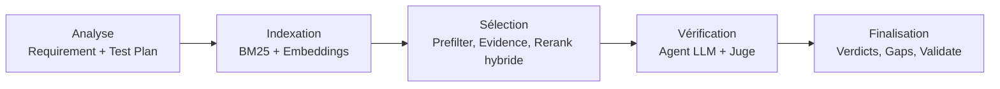
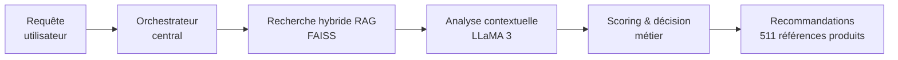

# Ammar Bedis

**I turn operational data into deployed AI systems, from ERP exports to production-ready agents.**

Computer Engineering Student, Data Science & AI @ ESPRIT, Tunis 🇹🇳

**Worked with**

---

## About

I move across three layers of the modern stack: building applications, orchestrating the AI systems inside them, and making sure the data feeding all of it is trustworthy.

Foundations → Development → AI Engineering is roughly how I got here: two years of math, algorithms and systems in the preparatory cycle, a year shipping full-stack applications, and now, designing agentic pipelines and applying ML to real data.

Today, that means I:
- Design multi-agent LLM systems: orchestration, tool-calling, RAG pipelines grounded in real evidence
- Build the data pipelines that feed them, from operational systems through ETL and warehousing to BI, and eventually, a working model
- Develop the full-stack applications that put both in front of a user

🎓 Looking for an end-of-studies internship (PFE), starting January 2027, open to AI engineering, data platform, or full-stack roles.

---

## Experience

**Sagemcom Software & Technologies**
*AI & Software Engineering Intern, Jul–Aug 2026*
Automated JIRA/Xray and internal RETRACK validation-report generation (Flask + Angular), cutting report time from 2h/day to under 2 minutes, and designed an 8-agent LLM/RAG pipeline to verify requirement-to-test coverage across 1,000+ Xray test cases.

---

## Featured projects

Three projects that best show how I put agentic AI and data systems together, end to end.

### Sagemcom RETRACK

An 8-agent coverage engine that checks whether every clause of a requirement is actually tested, and flags what's missing.

Eight specialized agents (requirement decomposer, rules/evidence engine, hybrid reranker, LLM verifier, judge, synthesizer, coverage-gap finder) sit around a central orchestrator. Retrieval combines BM25 with embeddings to surface the right clauses, a local LLM (Ollama) verifies each match with a citation and a counter-argument pass, and a calibrated judge applies strict confirmation thresholds before anything is flagged. On the validation set, the system reached a recall of 0.67 with zero false positives.

### VITAL — Agent Produits

A product-recommendation agent built for VITAL's catalog, as part of a larger multi-agent platform.

Hybrid retrieval (FAISS) narrows the catalog down to relevant candidates, an LLM (LLaMA 3) reasons over them with structured prompting, and a scoring layer turns that into a business decision, ranked recommendations across VITAL's 511-reference product catalog.

### EduVision

Image captioning with a CNN encoder (ResNet-50) and a Transformer decoder, using beam search decoding to improve BLEU-score performance over greedy decoding.

---

## Tech stack

**Agentic AI & LLM orchestration**: multi-agent pipelines, RAG, tool-calling

**Data science & machine learning**: classification, forecasting, anomaly detection

**Data engineering & BI**: Odoo, Talend, SQL Server, Power BI

**Software engineering**: the applications everything else lives inside

---

## Certifications

- NVIDIA: AI for Anomaly Detection
- NVIDIA: Fundamentals of Deep Learning
- 365 Data Science: CNN with TensorFlow in Python

---

Thanks for reading. Always happy to talk AI, data, or both.

