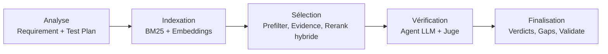
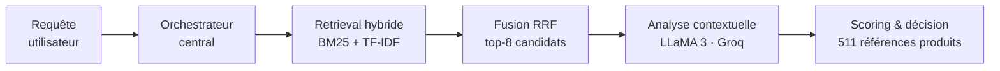
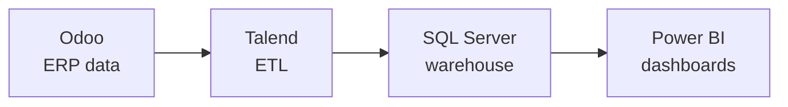

# Ammar Bedis

**I build retrieval and LLM systems that are measured, not demoed.**

Computer Engineering Student, Data Science & AI @ ESPRIT, Tunis 🇹🇳

**Worked with**

---

## About

My specialty is **retrieval engineering and the evaluation of LLM systems**: hybrid retrieval
(BM25, TF-IDF, dense embeddings, rank fusion), calibrated decision thresholds, and
multi-metric protocols that make a comparison mean something.

Two years of preparatory mathematics, a year shipping full-stack applications, and now
building agentic pipelines on real industrial data. What I care about in all of it is the
same thing: a system that reports a number I can defend.

Today that means I:

- Design multi-agent LLM systems — orchestration, tool-calling, RAG grounded in cited evidence
- Calibrate them: thresholds chosen against a labelled set, not against a demo
- Build the data pipelines that feed them, from operational systems through ETL and warehousing to BI
- Evaluate honestly, including when the result is negative

🎓 Looking for a **6-month end-of-studies internship (PFE), starting January to May 2027** —
AI engineering, data platform, or applied ML. ESPRIT internship agreement provided.

---

## Experience

**Sagemcom Software & Technologies** — *AI & Software Engineering Intern, Jul–Aug 2026*
Automated JIRA/Xray and internal RETRACK validation reporting (Flask + Angular), cutting
report time from ~2 h/day to under 2 minutes, and designed an 8-agent LLM/RAG pipeline
verifying requirement-to-test coverage across **1,350 Xray test cases**.

**Laboratoires VITAL × ESPRIT** — *AI Engineer, integrated project, 4 months*
Three modules of a multi-agent platform for the pharmaceutical industry: product
recommendation, CRM report structuring, and a social-media analytics pipeline.
*Team project; source code under NDA.*

**Tunisie Telecom** — *Networks & Telecom Intern, Jul–Aug 2025*
Fibre-network deployment data analysis and supporting technical documentation.

---

## Featured projects

### Sagemcom coverage engine — *code proprietary*

An 8-agent engine that checks whether every clause of a requirement is actually tested, and
flags what is missing.

Eight specialised agents (requirement decomposer, rules/evidence engine, hybrid reranker,
LLM verifier, judge, synthesiser, coverage-gap finder) around a central orchestrator.
Retrieval combines BM25 with dense embeddings, a local LLM (Ollama) verifies each match with
a citation and a counter-argument pass, and a calibrated judge applies strict confirmation
thresholds before anything is flagged.

**On the labelled validation set: 0.67 recall at zero false positives.** The operating point
was deliberately calibrated for maximum precision — in an industrial validation workflow, a
false flag costs an engineer's afternoon.

### VITAL — product recommendation agent — *code under NDA*

A product-recommendation agent over VITAL's catalogue, one of three modules I built inside a
larger multi-agent platform.

BM25 and TF-IDF retrieve in parallel and are merged by **Reciprocal Rank Fusion** into a
top-8 candidate set; intent and product detection structure the prompt; a LLaMA 3 layer
reasons over the candidates and emits scored, prioritised recommendations in structured form.

I also built the CRM report-structuring module (free-text field-visit reports across 6 report
types turned into structured records) and a social-media analytics pipeline, and engineered
the datasets behind them from 6 heterogeneous sources — product features expanded 22 → 174,
a multilingual FR/TN/AR review corpus, doctor and pharmacy references deduplicated,
translated AR→FR and geocoded.

### [Image-captioning benchmark](https://github.com/badisAM/Image-captioning-research-paper-Study)

Reproduction of *Show, Attend and Tell* (Xu et al.) on Flickr8k, plus a controlled comparison
of four architectures under one evaluation protocol.

| Model | BLEU-4 | METEOR | CIDEr | CLIPScore |
|---|---|---|---|---|
| SAT (VGG19 + LSTM attention) | **25.12** | 22.00 | 67.87 | 27.36 |
| SAT + caption fusion | 22.52 | 21.18 | 66.35 | 27.49 |
| ViT + Transformer decoder | 24.42 | **24.24** | **76.68** | 29.64 |
| BLIP-2 (zero-shot) | — | — | — | **30.37** |

Extended with a robustness study under rotation, blur, JPEG compression and noise — where
ViT patch embeddings proved markedly more blur-tolerant than VGG convolutional features
(38.7 % vs 69.7 % BLEU-4 degradation) — plus attention-map visualisation, Grad-CAM, and an
error typology. Results committed as CSV and JSON.

### [End-to-end MLOps pipeline](https://github.com/badisAM/drug-classification-mlops)

A deliberately simple model wrapped in a complete MLOps chain: MLflow tracking and model
registry, a 60-run hyperparameter sweep, FastAPI serving, Docker, and training metrics
shipped to Elasticsearch and visualised in Kibana. 97.50 % accuracy — on a 40-sample test
set, which the README says plainly. The pipeline is the point, not the model.

### [EmpathAI](https://github.com/badisAM/EmpathAI) — multimodal multi-agent assistant

A supervisor routes each turn to specialised agents (safety, emotion, retrieval, wellbeing,
generation) with the full decision path logged for auditability. Text and facial fusion
(DeepFace) detects mismatches between what someone writes and how they look. RAG over a
curated knowledge base, containerised FastAPI, deployed.

### [BI portal](https://github.com/badisAM/BI_portal)

Business intelligence for ERP analytics: sales reporting, product performance, payment
analysis. The public repository is a standalone demo version — it documents why embedding
real Power BI reports by iframe with `autoAuth=true` cannot work outside the owning Entra ID
tenant, and what to do instead.

---

## Tech stack

**Retrieval & LLM systems**: BM25, TF-IDF, dense embeddings, RRF fusion, RAG, multi-agent
orchestration, tool-calling, threshold calibration, evaluation design

**Machine learning & evaluation**: classification, forecasting, anomaly detection,
multi-metric protocols

**MLOps, data engineering & BI**

**Software engineering**: the applications everything else lives inside

---

## Education & certifications

**ESPRIT — School of Engineering and Technology**, Tunis · Engineering degree, Computer
Science, Data Science & AI (2024–2027) · GPA 13.85/20
**IPEI El Manar** · Preparatory classes (MP), Mathematics & Physics (2021–2024)

- NVIDIA — AI for Anomaly Detection (2026)
- NVIDIA — Fundamentals of Deep Learning (2026)
- 365 Data Science — CNN with TensorFlow in Python (2025)

Arabic (native) · French C1 (TCF 531/699) · English C1

---

Thanks for reading. Always happy to talk retrieval, evaluation, or both.

